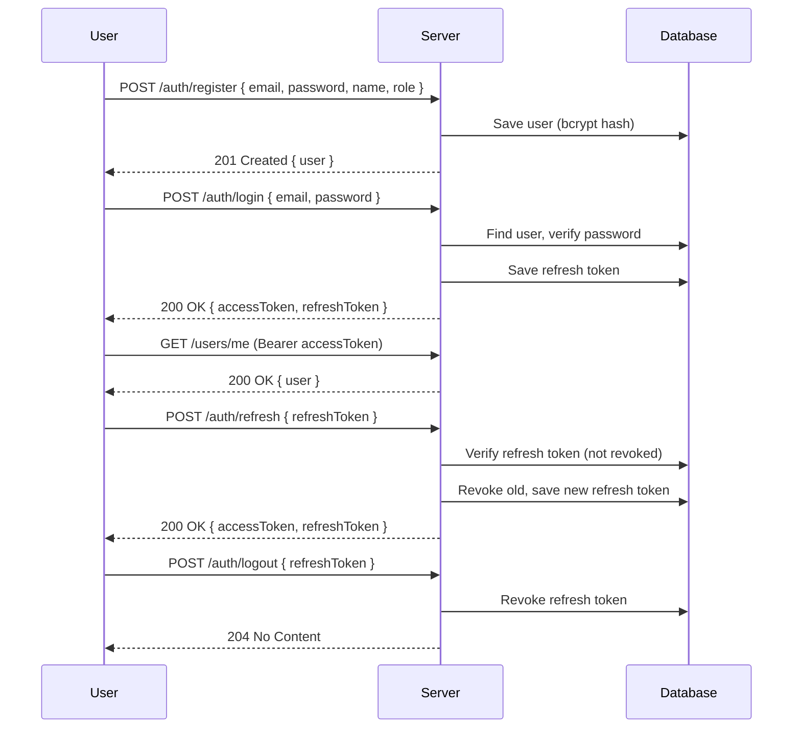
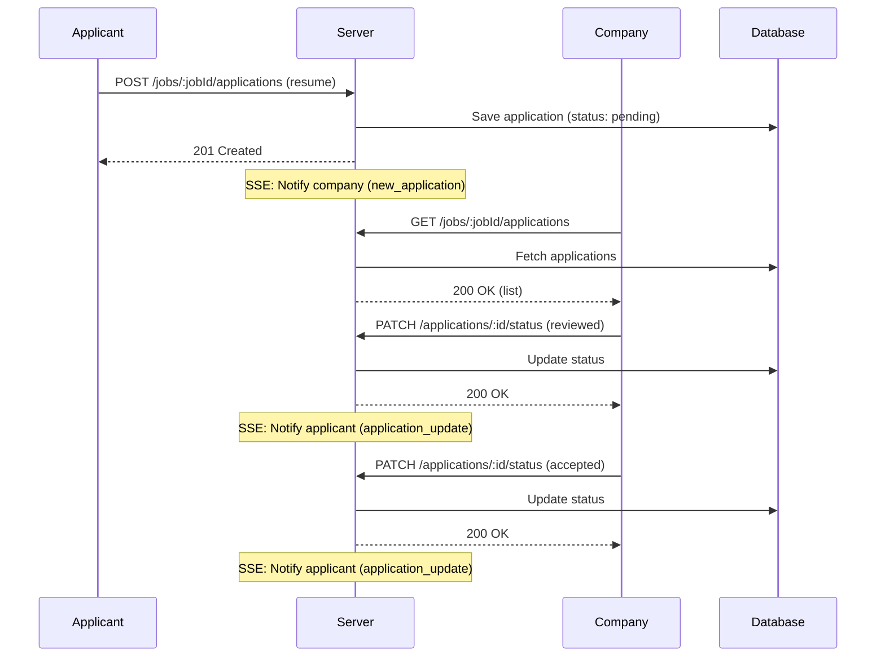
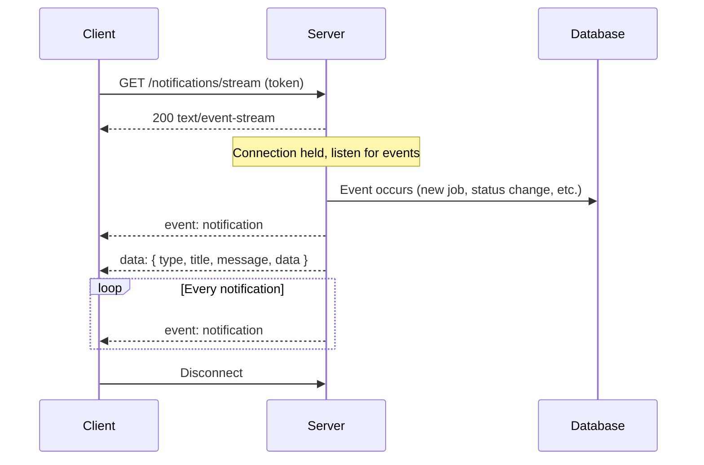
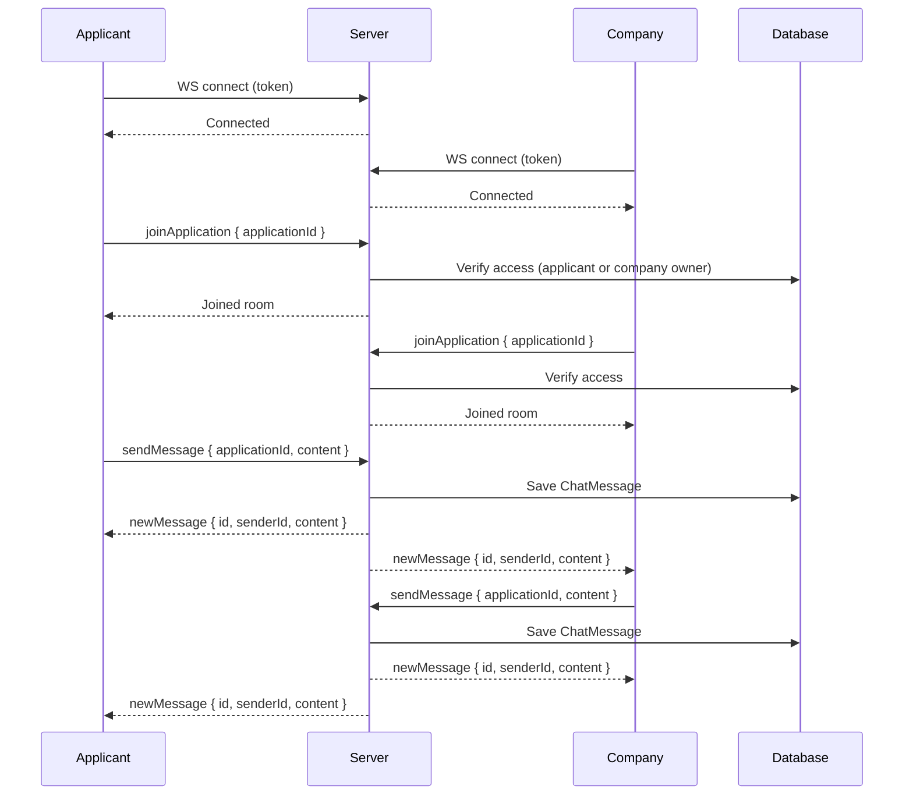

# Job Board API

Phase 3 — NestJS + RBAC + ACL + File Upload + SSE + WebSocket Chat

---

## Overview

Build a Job Board API where companies can post jobs and applicants can apply. Features include role-based access control, file uploads (resume/logo/attachment), real-time notifications via SSE, and simple WebSocket chat between company and applicant.

| Item | Value |
|---|---|
| Framework | NestJS |
| Language | TypeScript (strict) |
| Database | PostgreSQL + Prisma (TypedSQL) |
| Validation | Zod |
| Auth | JWT (access + refresh) + Passport |
| Real-time | SSE (notifications) + Socket.IO (chat) |
| Queue | BullMQ + Redis |
| Cache | ioredis (cache-aside) |
| Storage | MinIO (S3-compatible) |
| Testing | Vitest (unit + integration + e2e) |

---

## Entities

User, Company, Job, Application, Attachment, ChatMessage, Notification

---

## RBAC + ACL

### Roles

| Role | Description |
|---|---|
| `applicant` | Browse jobs, apply, upload resume, chat |
| `company` | Post jobs, manage company, review applications, chat |

### Endpoint Permissions

```
@Public()                          → anyone
@Roles('applicant')                → applicant only
@Roles('company')                  → company only
@Roles('company', 'applicant')    → both roles
```

### Ownership Rules (Service Layer)

```
Job CRUD:
  → Company can only edit/delete their own jobs
  → check: job.company.userId === currentUserId

Application review:
  → Company can only review applications for their own jobs
  → check: application.job.company.userId === currentUserId

Chat access:
  → Only the applicant and company owner can access
  → check: userId === application.userId || userId === application.job.company.userId

Company edit:
  → Company can only edit their own profile
  → check: company.userId === currentUserId
```

### Guard Chain

```
JwtAuthGuard → RolesGuard → Handler
                (RBAC)       (ownership check in service)
```

### Decorators

```typescript
@Public()                    // skip auth
@Roles('company')           // role check
@Roles('applicant')
@Roles('company', 'applicant')
@CurrentUser() user         // extract user from request
```

---

## API Spec

### Auth

```
POST /auth/register
  Body: { email, password, name, role: "company"|"applicant" }
  Response 201: { message, data: { id, email, name, role, createdAt }, requestId }
  Response 409: { message: "Email already exists", code: "auth.email_exists", requestId }

POST /auth/login
  Body: { email, password }
  Response 200: { message, data: { accessToken, refreshToken, user: { id, email, name, role } }, requestId }
  Response 401: { message: "Invalid credentials", code: "auth.invalid_credentials", requestId }

POST /auth/refresh
  Body: { refreshToken }
  Response 200: { message, data: { accessToken, refreshToken }, requestId }
  Response 401: { message: "Invalid refresh token", code: "auth.invalid_token", requestId }

POST /auth/logout
  Body: { refreshToken }
  Response 204: (no body)
```

### Users

```
GET /users/me
  Auth: required
  Response 200: { message, data: { id, email, name, role, createdAt }, requestId }

PATCH /users/me
  Auth: required
  Body: { name?, email? }
  Response 200: { message, data: { id, email, name, role }, requestId }
```

### Companies

```
POST /companies
  Auth: required (role: applicant → company)
  Body: { name, description?, website? }
  Response 201: { message, data: { id, userId, name, description, logoUrl, website, createdAt }, requestId }
  Response 409: { message: "Company already exists", code: "company.already_exists", requestId }

GET /companies/:id
  Auth: optional
  Response 200: { message, data: { ...company, jobCount }, requestId }
  Response 404: { message: "Company not found", code: "company.not_found", requestId }

PATCH /companies/:id
  Auth: required (owner only)
  Body: { name?, description?, website? }
  Response 200: { message, data: { ...company }, requestId }
  Response 403: { message: "Forbidden", code: "company.forbidden", requestId }

POST /companies/:id/logo
  Auth: required (owner only)
  Body: multipart/form-data { file: image/*, max 5MB }
  Response 200: { message, data: { logoUrl (presigned URL) }, requestId }
```

### Jobs

```
POST /jobs
  Auth: required (role: company)
  Body: { title, description, location?, salaryMin?, salaryMax? }
  Response 201: { message, data: { ...job }, requestId }

GET /jobs
  Auth: public
  Query: ?page=1&limit=20&search=&location=&salaryMin=&salaryMax=
  Response 200: { message, data: [...jobs], meta: { page, limit, total }, requestId }

GET /jobs/:id
  Auth: public
  Response 200: { message, data: { ...job, company: { id, name, logoUrl }, attachments: [{ id, filename, originalName, mimeType, size }], _count: { applications } }, requestId }

PATCH /jobs/:id
  Auth: required (owner company)
  Body: { title?, description?, location?, salaryMin?, salaryMax? }
  Response 200: { message, data: { ...job }, requestId }
  Response 403: { message: "Forbidden", code: "job.forbidden", requestId }

DELETE /jobs/:id
  Auth: required (owner company)
  Response 204: (no body)

POST /jobs/:id/attachments
  Auth: required (owner company)
  Body: multipart/form-data { file: application/pdf|image/*, max 10MB }
  Response 201: { message, data: { id, filename, originalName, mimeType, size, url (presigned URL) }, requestId }

DELETE /jobs/:jobId/attachments/:attachmentId
  Auth: required (owner company)
  Response 204: (no body)
  Response 403: { message: "Forbidden", code: "attachment.forbidden", requestId }
  Response 404: { message: "Attachment not found", code: "attachment.not_found", requestId }
```

### Applications

```
POST /jobs/:jobId/applications
  Auth: required (role: applicant)
  Body: multipart/form-data { file: application/pdf, max 5MB } (resume)
  Response 201: { message, data: { ...application, resumeUrl (presigned URL) }, requestId }
  Response 409: { message: "Already applied", code: "application.already_applied", requestId }

GET /applications
  Auth: required (role: applicant)
  Query: ?page=1&limit=20&status=
  Response 200: { message, data: [{ id, jobId, status, resumeUrl, createdAt, job: { id, title, company: { id, name } } }], meta: { page, limit, total }, requestId }

GET /jobs/:jobId/applications
  Auth: required (owner company)
  Query: ?page=1&limit=20&status=
  Response 200: { message, data: [{ id, userId, status, resumeUrl, createdAt, user: { id, name, email } }], meta: { page, limit, total }, requestId }

PATCH /applications/:id/status
  Auth: required (owner company)
  Body: { status: "reviewed"|"accepted"|"rejected" }
  Response 200: { message, data: { id, jobId, userId, status, resumeUrl, createdAt }, requestId }
  Response 403: { message: "Forbidden", code: "application.forbidden", requestId }
  Response 404: { message: "Application not found", code: "application.not_found", requestId }
```

### Notifications

```
GET /notifications
  Auth: required
  Query: ?page=1&limit=20&unread=true|false
  Response 200: { message, data: [{ id, type, title, message, read, data, createdAt }], meta: { page, limit, total, unreadCount }, requestId }

PATCH /notifications/:id/read
  Auth: required (owner)
  Response 200: { message, data: { id, type, title, message, read: true, data, createdAt }, requestId }
  Response 404: { message: "Notification not found", code: "notification.not_found", requestId }

@SSE GET /notifications/stream
  Auth: required (Bearer token in query param)
  Response: text/event-stream
  Events:
    - event: notification
      data: { type, title, message, data, createdAt }
```

### Chat

```
GET /chat/:applicationId/messages
  Auth: required (applicant of application OR company owner)
  Query: ?page=1&limit=50
  Response 200: { message, data: [...messages], meta, requestId }

WS /chat
  Auth: token in handshake query
  Events:
    Client → Server:
      - joinApplication: { applicationId }
      - sendMessage: { applicationId, content }
    Server → Client:
      - newMessage: { id, senderId, senderName, content, createdAt }
      - error: { message }
```

### Files

```
GET /files/:type/:id
  Auth: required (logos: optional/public)
  Params: type = resumes | logos | attachments
  Response 200: { message, data: { url (presigned URL, 1hr expiry) }, requestId }
  Response 403: { message: "Forbidden", code: "file.forbidden", requestId }
  Response 404: { message: "File not found", code: "file.not_found", requestId }
```

---

## SSE Spec

**Endpoint:** `GET /notifications/stream`

**Connection:**
```
Authorization: Bearer <accessToken> (via query param: ?token=xxx)
Accept: text/event-stream
```

**Event Format:**
```
event: notification
data: {"type":"new_job","title":"New job posted","message":"Senior Developer at TechCo","data":{"jobId":123},"createdAt":"2026-07-08T10:00:00.000Z"}
```

**Notification Types:**
| Type | Trigger | Title | Data |
|---|---|---|---|
| `new_job` | Company posts job | "New job posted" | `{ jobId }` |
| `new_application` | Applicant applies | "New application received" | `{ applicationId, jobId }` |
| `application_update` | Status changed | "Application status updated" | `{ applicationId, status }` |
| `new_message` | Chat message | "New message" | `{ applicationId, senderId }` |

---

## WebSocket Spec

**Connection:** `ws://localhost:3000/chat?token=<accessToken>`

**Events:**

| Event | Direction | Payload |
|---|---|---|
| `joinApplication` | Client → Server | `{ applicationId }` |
| `sendMessage` | Client → Server | `{ applicationId, content }` |
| `newMessage` | Server → Client | `{ id, senderId, senderName, content, createdAt }` |
| `error` | Server → Client | `{ message }` |

**Rules:**
- Only applicant who applied AND company owner can join room
- Messages persisted to database
- Simple broadcast to room (no typing indicators, no read receipts)

---

## File Upload Spec

**Storage:** MinIO (S3-compatible), single private bucket `job-board-uploads`

### Upload Types

| Type | Owner | Max Size | Allowed Types | MinIO Path |
|---|---|---|---|---|
| Resume | Applicant | 5MB | application/pdf | `resumes/{userId}_{timestamp}.{ext}` |
| Logo | Company owner | 5MB | image/* | `logos/{companyId}_{timestamp}.{ext}` |
| Attachment | Company owner | 10MB | application/pdf, image/* | `attachments/{jobId}_{timestamp}.{ext}` |

### ACL (Application-Level)

| File Type | ACL Rule | Access Check |
|---|---|---|
| Logo | Public (anyone) | No check needed |
| Resume | Owner + Job company | `userId === currentUserId` OR `job.company.userId === currentUserId` |
| Attachment | Job owner only | `job.company.userId === currentUserId` |

### File Access Flow

```
1. Client requests file → GET /files/:type/:id
2. Server fetches metadata from DB
3. Server checks ACL (ownership check)
4. If authorized → generate presigned URL (1hr expiry) → return
5. If not → 403 Forbidden
```

### Upload Flow

```
1. Client upload → POST endpoint (multipart/form-data)
   - Resume:     POST /jobs/:jobId/applications → saves to resumes/{userId}_{timestamp}.{ext}
   - Logo:       POST /companies/:id/logo → saves to logos/{companyId}_{timestamp}.{ext}
   - Attachment: POST /jobs/:id/attachments → saves to attachments/{jobId}_{timestamp}.{ext}
2. Server saves metadata to DB
3. Response: presigned URL (immediate access)
```

### Validation
- File size limit enforced by Multer config
- MIME type checked server-side
- Original filename preserved in DB, random filename in MinIO

---

## Cache Spec

**Library:** ioredis

**Pattern:** Cache-aside with hash-based keys

### Cache Key Format

```
List:    {resource}:{hash(normalized_query)}
Detail:  {resource}:detail:{id}
```

**Query Normalization (for list keys):**
1. Sort parameters alphabetically
2. Remove undefined/null values
3. Stringify → MD5 hash

### Cached Endpoints

| Endpoint | Cache Key Pattern | TTL | Invalidation |
|---|---|---|---|
| `GET /jobs` | `jobs:{hash}` | 5 min | SCAN + delete `jobs:*` |
| `GET /jobs/:id` | `jobs:detail:{id}` | 10 min | Delete key |
| `GET /companies/:id` | `companies:detail:{id}` | 15 min | Delete key |

### Cache Flow

```
1. Client requests GET /jobs
2. Normalize query → MD5 hash → build key
3. Check Redis: cache hit → return
4. Cache miss → query DB → store in Redis → return
```

### Cache Invalidation

```
Job created/updated/deleted → SCAN + delete all jobs:* keys
Company updated → delete companies:detail:{id}
```

### File Access (No Cache)

```
File access (GET /files/:type/:id) not cached.
Presigned URLs generated on every request (fast, one MinIO call).
```

---

## Logging Spec

**Library:** `pino` + `pino-pretty` (dev only)

### Three Layers

| Layer | What to Log | Example |
|---|---|---|
| **Request** | Method, path, userId, requestId | `GET /jobs user:123 req:a1b2c3` |
| **Business** | Critical actions, state changes | `Job created jobId:456 companyId:789` |
| **Error** | Full error + context + stack | `ConflictException code:job.in_use jobId:456` |

### Implementation
- `LoggingInterceptor` — log request/response cycle with duration
- `RequestIdMiddleware` — inject `X-Request-Id` to every request
- Service layer — log business events (job created, application status changed)
- Error filter — log all exceptions with full context

### Structured Log Format
```json
{
  "level": "info",
  "time": "2026-07-08T10:00:00.000Z",
  "requestId": "a1b2c3",
  "userId": 123,
  "method": "POST",
  "path": "/jobs",
  "status": 201,
  "duration": 45,
  "message": "Job created"
}
```

### Log Levels
| Level | When |
|---|---|
| `info` | Request completed, business events |
| `warn` | Validation errors, rate limit hits |
| `error` | Unhandled exceptions, DB errors |
| `debug` | SQL queries (dev only), cache hits/misses |

### Environment Config
| Env | Config |
|---|---|
| dev | `pino-pretty` transport, debug level |
| test | silent (no log output) |
| prod | JSON format, info level |

---

## Testing Spec

**Framework:** Vitest or Jest + supertest

### 3-Layer Testing

| Layer | Location | What to Test | DB? | Mock? |
|---|---|---|---|---|
| **Unit** | `src/**/*.spec.ts` | Service logic, guards, pipes, interceptors | No | Yes (mock Prisma) |
| **Integration** | `src/**/*.integration-spec.ts` | Repository queries, Prisma typed SQL | Yes (real DB) | No |
| **E2E** | `tests/e2e/**/*.test.ts` | Full HTTP cycle, auth, validation, ownership | Yes (real DB) | No |

### Unit Tests
- Service business logic (ownership check, validation, error paths)
- Guards (RolesGuard, JwtAuthGuard behavior)
- Pipes (ZodValidationPipe — valid/invalid input)
- Interceptors (ResponseInterceptor envelope, LoggingInterceptor)

### Integration Tests
- Prisma typed SQL queries (CRUD, filtering, pagination)
- DB constraints (unique, foreign key cascade)
- Raw SQL edge cases

### E2E Tests
- All endpoints (happy path + error paths)
- Auth flow (register → login → access protected route)
- RBAC (role check, ownership check)
- File upload (multipart/form-data)
- SSE connection + event format
- WebSocket connection + message flow
- Pagination + filtering
- Error envelope format

### Test Infrastructure
```
tests/
├── setup/
│   ├── setup-file.ts        — Create app, truncate DB before each test
│   ├── db.ts                — App lifecycle + direct Prisma for truncation
│   └── helpers.ts           — seedUser(), seedCompany(), seedJob(), login(), authedReq()
├── e2e/
│   ├── auth.test.ts
│   ├── companies.test.ts
│   ├── jobs.test.ts
│   ├── applications.test.ts
│   ├── notifications.test.ts
│   ├── chat.test.ts
│   └── files.test.ts
```

---

## Flowcharts

### Auth Flow



### Application Flow



### SSE Notification Flow



### WebSocket Chat Flow



---

## Stack

| Category | Tools |
|---|---|
| Framework | NestJS |
| Language | TypeScript (strict) |
| DB / ORM | PostgreSQL + Prisma (TypedSQL) |
| Validation | Zod (custom pipe) |
| Auth | passport-jwt, bcrypt, JWT access + refresh |
| File Upload | Multer S3, @aws-sdk/s3-client, MinIO |
| SSE | @Sse decorator, RxJS Observable |
| WebSocket | @nestjs/websockets + Socket.IO |
| Queue | BullMQ + Redis |
| Cache | ioredis (cache-aside) |
| Config | @nestjs/config |
| Docs | @nestjs/swagger (code-first) |
| Logging | pino + pino-pretty (dev) |
| Testing | Vitest or Jest, supertest |
| Formatter | ESLint |

---

## Tasks

| # | Task | Complexity | Learning | Total | Required |
|---|---|---|---|---|---|
| 1 | Project Setup | 3 | 2 | 5 | ✅ |
| 2 | Auth | 2 | 2 | 4 | ✅ |
| 3 | RBAC + ACL | 4 | 5 | 9 | ✅ |
| 4 | Companies | 2 | 2 | 4 | ✅ |
| 5 | Jobs | 3 | 3 | 6 | ✅ |
| 6 | Applications | 3 | 3 | 6 | ✅ |
| 7 | File Access | 3 | 4 | 7 | ✅ |
| 8 | Cache | 4 | 4 | 8 | ⬜ |
| 9 | Notifications (SSE) | 4 | 4 | 8 | ✅ |
| 10 | WebSocket Chat | 4 | 4 | 8 | ✅ |
| 11 | Swagger + Config | 2 | 3 | 5 | ✅ |
| 12 | Logging | 3 | 3 | 6 | ✅ |
| 13 | Testing | 4 | 5 | 9 | ✅ |
| 14 | Postman Collection | 1 | 2 | 3 | ⬜ |

---

## Git Workflow

### Conventional Commits

Format: `type(scope): description`

| Type | When | Example |
|---|---|---|
| `feat` | New feature | `feat(auth): add JWT refresh token` |
| `fix` | Bug fix | `fix(jobs): handle null salary filter` |
| `docs` | Documentation | `docs: update API spec for applications` |
| `refactor` | Code restructure | `refactor(companies): extract upload service` |
| `test` | Add/update tests | `test(jobs): add ownership check tests` |
| `chore` | Config, deps, CI | `chore: add MinIO to docker-compose` |
| `style` | Formatting, lint | `style: fix biome warnings` |

### Atomic Commits

- One logical change per commit
- Each commit should be revertable without breaking
- Don't mix unrelated changes

**Good:**
```
feat(applications): add resume upload endpoint
test(applications): add upload + ACL tests
```

**Bad:**
```
feat(applications): add upload + fix jobs + update readme
```

### Branch Strategy

```
main        ← production-ready
  └── feat/* ← feature branches (feat/auth, feat/jobs)
```

- Branch from `main`
- PR to `main`
- Squash merge preferred
